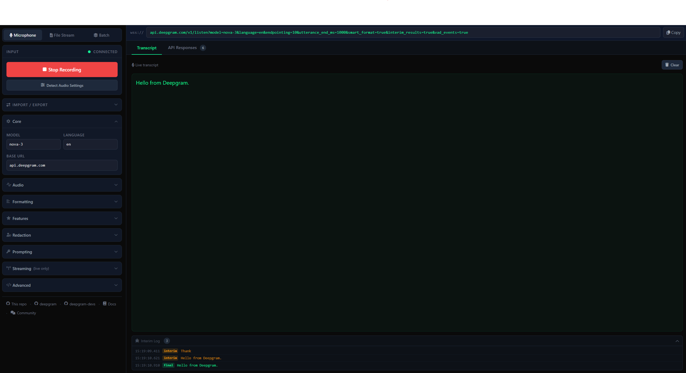

# Deepgram STT Explorer

An interactive demo app for exploring Deepgram's real-time speech-to-text API. Supports live microphone streaming, audio file streaming, and batch transcription — with a full params panel so you can experiment with every Deepgram option without writing code.

**Live demo:** [deepgram-python-stt.fly.dev](https://deepgram-python-stt.fly.dev)



---

## Features

- **Mic streaming** — Real-time transcription from your browser microphone using Deepgram's WebSocket API
- **File streaming** — Upload an audio file and stream it to Deepgram in real-time, with transcript synced to playback
- **Batch transcription** — Submit a file or URL for single-shot transcription via the REST API
- **Live params panel** — Toggle every major Deepgram option (model, language, smart format, VAD, endpointing, redaction, keyterms, and more) and see the URL update instantly
- **Import / Export** — Paste a Deepgram WebSocket URL or JSON object to import settings; copy the current URL to share a configuration
- **API responses tab** — Every WebSocket event (interim, final, metadata) logged with expandable JSON
- **Error display** — Stream errors surfaced directly in the UI with a red badge in the responses tab

<!-- TODO: add screenshot of file streaming mode -->
<!--  -->

---

## Stack

| Layer | Technology |
|-------|-----------|
| Backend | FastAPI + python-socketio (async) + uvicorn |
| Deepgram | [deepgram-sdk](https://github.com/deepgram/deepgram-python-sdk) v6.x (async WebSocket API) |
| Frontend | Alpine.js (no build step) |
| Deployment | Fly.io |
| Tests | pytest + asyncio + UvicornTestServer + socketio.AsyncClient |

---

## Quickstart

### Prerequisites

- Python 3.12+
- [uv](https://github.com/astral-sh/uv) (recommended) or pip
- A [Deepgram API key](https://console.deepgram.com/signup?jump=keys)

### Run locally

```bash
git clone https://github.com/Jacob-Lasky/deepgram-python-stt
cd deepgram-python-stt

cp sample.env .env
# Edit .env and add your DEEPGRAM_API_KEY

uv run uvicorn app:app --host 0.0.0.0 --port 8080
```

Open [http://localhost:8080](http://localhost:8080).

### Run with Docker

```bash
docker build -t deepgram-stt .
docker run -p 8080:8080 -e DEEPGRAM_API_KEY=your_key_here deepgram-stt
```

---

## Configuration

Copy `sample.env` to `.env`:

```env
DEEPGRAM_API_KEY=your_key_here
```

---

## Supported Redact Values

All values below are verified to work with the Deepgram streaming API:

| Value | Description |
|-------|-------------|
| `pci` | Credit card numbers, expiration dates, CVV |
| `ssn` | Social security numbers |
| `credit_card` | Credit card numbers (granular) |
| `account_number` | Bank account numbers |
| `routing_number` | ABA routing numbers |
| `passport_number` | Passport numbers |
| `driver_license` | Driver's license numbers |
| `numerical_pii` | Numerical PII (granular) |
| `numbers` | Series of 3+ consecutive numerals |
| `aggressive_numbers` | All numerals |
| `phi` | Protected health information |
| `name` | Person names |
| `dob` | Dates of birth |
| `username` | Usernames |

---

## Running Tests

```bash
uv run pytest tests/ -v
```

30 tests, 1 skipped. Tests use a real `UvicornTestServer` + `socketio.AsyncClient` — no mocking of the SocketIO layer.

<!-- TODO: add screenshot of batch mode -->
<!--  -->

---

## Key Gotchas

Non-obvious things discovered during the Flask/gevent → FastAPI async migration:

- **`gevent.monkey.patch_all()` must be the very first edit** — it corrupts the asyncio event loop at import time even if called before imports
- **`socketio.ASGIApp` must wrap FastAPI** — pointing uvicorn at `fastapi_app` directly causes SocketIO 404s
- **`AsyncServer` has no `test_client()`** — tests require a real `UvicornTestServer` + `socketio.AsyncClient` fixture
- **SDK callbacks must be `async def` with `**kwargs`** — sync callbacks or missing `**kwargs` silently never fire
- **Audio `timeslice` must be 250ms** — 1000ms chunks cause the last word before Stop to be dropped
- **`stream_started` must emit immediately on WS connect**, not after `Metadata` — Metadata timing is non-deterministic and can block the frontend for 10+ seconds
- **Deepgram boolean params must be lowercase strings** (`"true"`/`"false"`), not Python bools

---

## Deploying to Fly.io

```bash
fly launch --name your-app-name   # first time only
fly secrets set DEEPGRAM_API_KEY=your_key_here
fly deploy
```

The `fly.toml` and `Dockerfile` are already configured for uvicorn on port 8080.

---

## Getting Help

- [Open an issue](https://github.com/Jacob-Lasky/deepgram-python-stt/issues/new)
- [Deepgram Community](https://community.deepgram.com/)
- [Deepgram Docs](https://developers.deepgram.com/)
- [Deepgram GitHub](https://github.com/deepgram)
- [Deepgram Devs GitHub](https://github.com/deepgram-devs)

---

## License

MIT — see [LICENSE](./LICENSE)
