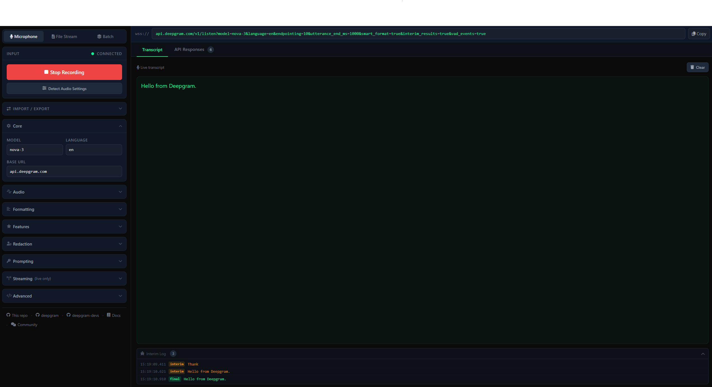
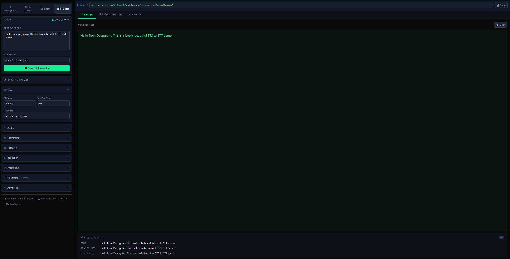

# Deepgram STT Explorer

An interactive demo app for exploring Deepgram's real-time speech-to-text API. Supports live microphone streaming, audio file streaming, and batch transcription — with a full params panel so you can experiment with every Deepgram option without writing code.

**Live demo:** [deepgram-python-stt.fly.dev](https://deepgram-python-stt.fly.dev)



---

## Features

- **Mic streaming** — Real-time transcription from your browser microphone using Deepgram's WebSocket API
- **File streaming** — Upload an audio file and stream it to Deepgram in real-time, with transcript synced to playback
- **Batch transcription** — Submit a file or URL for single-shot transcription via the REST API
- **TTS Test mode** — Type any text, generate speech via Deepgram TTS, and transcribe it back through the STT pipeline. Ideal for testing redaction, formatting, and model behavior without a microphone
- **Live params panel** — Toggle every major Deepgram option (model, language, smart format, VAD, endpointing, redaction, keyterms, and more) and see the URL update instantly
- **Import / Export** — Paste a Deepgram WebSocket URL or JSON object to import settings; copy the current URL to share a configuration
- **API responses tab** — Every WebSocket event (interim, final, metadata) logged with expandable JSON
- **Error display** — Stream errors surfaced directly in the UI with a red badge in the responses tab

---

## TTS Test Mode

The TTS Test tab lets you verify STT behavior end-to-end without a microphone. Type any text, choose a TTS voice, and click **Speak & Transcribe** — the app generates audio via Deepgram's TTS API and feeds it directly through the STT pipeline using your current param settings.

After each run, a **TTS Comparison** panel shows:

| Row | Description |
|-----|-------------|
| **Sent** | The original input text |
| **Transcribed** | What the STT returned |
| **Difference** | Word-level diff — deletions in ~~red~~, insertions in **green**, replacements as old→new |



This is especially useful for testing redaction (does the PII actually get replaced?), smart formatting (are numbers and punctuation correct?), and model comparisons.

### API endpoint

The TTS→STT pipeline is also exposed as a REST endpoint for automated testing:

```bash
curl -s -X POST "https://deepgram-python-stt.fly.dev/api/tts-transcribe" \
  -H "Content-Type: application/json" \
  -d @- << 'EOF'
{
  "text": "My credit card is 4111 1111 1111 1111 and my SSN is 123-45-6789.",
  "tts_model": "aura-2-asteria-en",
  "stt_params": {
    "model": "nova-3",
    "redact": ["credit_card", "ssn"],
    "smart_format": true
  }
}
EOF
```

Response is the full Deepgram STT JSON object.

---

## Stack

| Layer | Technology |
|-------|-----------|
| Backend | FastAPI + python-socketio (async) + uvicorn |
| Deepgram | [deepgram-sdk](https://github.com/deepgram/deepgram-python-sdk) v6.x (async WebSocket API) |
| Frontend | Alpine.js (no build step) |
| Deployment | Fly.io |
| Tests | pytest + asyncio + UvicornTestServer + socketio.AsyncClient |

---

## Quickstart

### Prerequisites

- Python 3.12+
- [uv](https://github.com/astral-sh/uv) (recommended) or pip
- A [Deepgram API key](https://console.deepgram.com/signup?jump=keys)

### Run locally

```bash
git clone https://github.com/Jacob-Lasky/deepgram-python-stt
cd deepgram-python-stt

cp sample.env .env
# Edit .env and add your DEEPGRAM_API_KEY

uv run uvicorn app:app --host 0.0.0.0 --port 8080
```

Open [http://localhost:8080](http://localhost:8080).

### Run with Docker

```bash
docker build -t deepgram-stt .
docker run -p 8080:8080 -e DEEPGRAM_API_KEY=your_key_here deepgram-stt
```

---

## Configuration

Copy `sample.env` to `.env`:

```env
DEEPGRAM_API_KEY=your_key_here
ELEVENLABS_API_KEY=       # optional, only for the ElevenLabs TTS provider
```

### Security and abuse limits

This app holds a Deepgram key server-side and calls Deepgram on behalf of
whoever hits it, so these bound what a caller can do:

| Variable | Default | Purpose |
|----------|---------|---------|
| `APP_ACCESS_TOKEN` | *(unset)* | Shared secret that LIFTS the anonymous limits. Unset means every caller is privileged, which is what local dev wants. |
| `REQUIRE_AUTH` | *(unset)* | When true, the app refuses to boot without `APP_ACCESS_TOKEN`, so a deploy cannot silently come up with its limits disabled. Set to `true` in `fly.toml`. |
| `ANON_ACCESS` | `true` | Set false to require a token outright. Leaving it true is the point: the demo has to work for a visitor. |
| `ANON_RATE_LIMIT` / `ANON_RATE_WINDOW_S` | `15` / `300` | Per-IP request budget. |
| `ANON_GLOBAL_LIMIT` / `ANON_GLOBAL_WINDOW_S` | `300` / `3600` | Budget across ALL anonymous traffic. This is the control that actually caps the bill. |
| `ANON_MAX_CONCURRENT_STREAMS` | `3` | Simultaneous untokened streams. |
| `ANON_MAX_STREAM_SECONDS` | `120` | Wall-clock cap on an untokened stream. |
| `ANON_MAX_TTS_CHARS` / `ANON_MAX_UPLOAD_BYTES` | `400` / `10MB` | Tighter per-request caps for the anonymous tier. |
| `MAX_TTS_CHARS` / `MAX_UPLOAD_BYTES` | `2000` / `100MB` | Per-request caps for the privileged tier. |
### Access is a budget, not a wall

This app is both a capability demo and a diagnostic tool, so an anonymous
visitor gets a **working** app, mic streaming included. A dead UI demos nothing.
The token raises the limits rather than unlocking the door.

| | Anonymous | With a token |
|---|---|---|
| Load the UI | yes | yes |
| Mic / file / batch / TTS | yes | yes |
| Requests | 15 per IP per 5 min, and 300/hour across all anonymous traffic | unlimited |
| Concurrent streams | 3 | unlimited |
| Stream length | 120s | unlimited |
| TTS text | 400 chars | 2000 chars |
| Upload | 10MB | 100MB |
| Audio by URL | must report a `Content-Length` within the upload cap | any |

**The global hourly ceiling is the load-bearing control, not the per-IP limit.**
IPs are cheap, so per-IP only stops one person hammering; the global cap is what
makes a distributed attempt pointless. Do not remove it on the grounds that
per-IP covers it.

**The SocketIO stream is metered exactly like the HTTP API.** Mic and file
streaming spend the Deepgram key over that socket. Do not exempt it because
"only our own page opens it": the browser is attacker-controlled, so there is no
way to authenticate the page as distinct from a user, and anyone who loads the
public page can read its network calls and replay them.

**An anonymous caller may not hand Deepgram a URL of unknown length.** Uploads
are capped as they stream, but one allowed request pointing at a ten-hour
recording is unbounded spend the rate limit cannot see, so `/transcribe` HEADs
the URL first and refuses a missing or oversized `Content-Length`.

Three ways to send the token, in precedence order:

```bash
curl -H "X-App-Token: $APP_ACCESS_TOKEN" ...      # canonical
curl -H "Authorization: Bearer $APP_ACCESS_TOKEN" ...
curl "https://…/files/clip.wav?token=$APP_ACCESS_TOKEN"   # for <audio src>, which cannot send headers
```

Share the app as `https://your-app.fly.dev/?token=YOUR_TOKEN`. The frontend
reads the token, stores it in `sessionStorage`, strips it back out of the visible
URL so it does not leak into a screenshot, and attaches it to every call
including the socket handshake. Anonymous visitors see a banner explaining the
demo budget, and a hit limit is reported in place rather than looking broken.
Scripts in `scripts/` read `APP_ACCESS_TOKEN` from the environment.

```bash
fly secrets set APP_ACCESS_TOKEN="$(openssl rand -hex 24)"
```

**Rate-limit state is in-process, which is correct here:** `fly.toml` pins the
app to a single machine with a single worker because python-socketio keeps
session state in memory. Scaling past one machine needs an external store for
these counters as well as for the socket sessions.

**Still open:** `cors_allowed_origins` is `"*"`. Use a scoped `usage:write`
Deepgram key rather than an org-wide one, and set a spend ceiling with alerting.

## Supported Redact Values

All values below are verified to work with the Deepgram streaming API:

| Value | Description |
|-------|-------------|
| `pci` | Credit card numbers, expiration dates, CVV |
| `ssn` | Social security numbers |
| `credit_card` | Credit card numbers (granular) |
| `account_number` | Bank account numbers |
| `routing_number` | ABA routing numbers |
| `passport_number` | Passport numbers |
| `driver_license` | Driver's license numbers |
| `numerical_pii` | Numerical PII (granular) |
| `numbers` | Series of 3+ consecutive numerals |
| `aggressive_numbers` | All numerals |
| `phi` | Protected health information |
| `name` | Person names |
| `dob` | Dates of birth |
| `username` | Usernames |

---

## Running Tests

```bash
uv run pytest tests/ -v
```

86 tests, 1 skipped. Tests use a real `UvicornTestServer` + `socketio.AsyncClient` — no mocking of the SocketIO layer.

<!-- TODO: add screenshot of batch mode -->
<!--  -->

---

## Key Gotchas

Non-obvious things discovered during the Flask/gevent → FastAPI async migration:

- **`gevent.monkey.patch_all()` must be the very first edit** — it corrupts the asyncio event loop at import time even if called before imports
- **`socketio.ASGIApp` must wrap FastAPI** — pointing uvicorn at `fastapi_app` directly causes SocketIO 404s
- **`AsyncServer` has no `test_client()`** — tests require a real `UvicornTestServer` + `socketio.AsyncClient` fixture
- **SDK callbacks must be `async def` with `**kwargs`** — sync callbacks or missing `**kwargs` silently never fire
- **Audio `timeslice` must be 250ms** — 1000ms chunks cause the last word before Stop to be dropped
- **`stream_started` must emit immediately on WS connect**, not after `Metadata` — Metadata timing is non-deterministic and can block the frontend for 10+ seconds
- **Deepgram boolean params must be lowercase strings** (`"true"`/`"false"`), not Python bools
- **Never join a caller-supplied filename onto a directory** — Python's `Path` join *replaces* the base when the right side is absolute, so `TEMP_DIR / "/etc/passwd"` is `/etc/passwd`. Take `Path(name).name` and assert the resolved parent.
- **Never interpolate a caller-supplied host into a URL that carries your API key** — it forwards the credential to whatever host they named.

---

## Deploying to Fly.io

```bash
fly launch --name your-app-name   # first time only
fly secrets set DEEPGRAM_API_KEY=your_key_here
fly deploy
```

Pushing to `main` also deploys, via `.github/workflows/fly-deploy.yml`. That
workflow has no test gate, so run `uv run pytest tests/ -q` first. **Check
whether the running app is ahead of `main` before you push:** deploying `main`
while production carries newer code silently reverts it.

The `fly.toml` and `Dockerfile` are already configured for uvicorn on port 8080.

---

## Getting Help

- [Open an issue](https://github.com/Jacob-Lasky/deepgram-python-stt/issues/new)
- [Deepgram Community](https://community.deepgram.com/)
- [Deepgram Docs](https://developers.deepgram.com/)
- [Deepgram GitHub](https://github.com/deepgram)
- [Deepgram Devs GitHub](https://github.com/deepgram-devs)

---

## License

MIT — see [LICENSE](./LICENSE)
